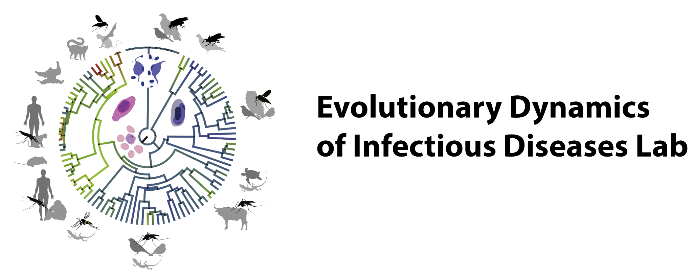

About the lab
=============

The **Escalante–Pacheco Lab** (Temple University) studies the **evolutionary dynamics of infectious diseases**,
with a strong focus on malaria parasites and other haemosporidians.

This documentation site is part of our effort to make lab workflows:

- **reproducible** (same inputs → same outputs)
- **auditable** (logs + metadata)
- **portable** (GUI for routine use; CLI for automation)

Contact and links
-----------------

- Lab home page: *(add your lab URL here)*
- Source code: ``https://github.com/<GITHUB_ORG_OR_USER>/<REPO_NAME>``
- Issues / support: ``https://github.com/<GITHUB_ORG_OR_USER>/<REPO_NAME>/issues``
