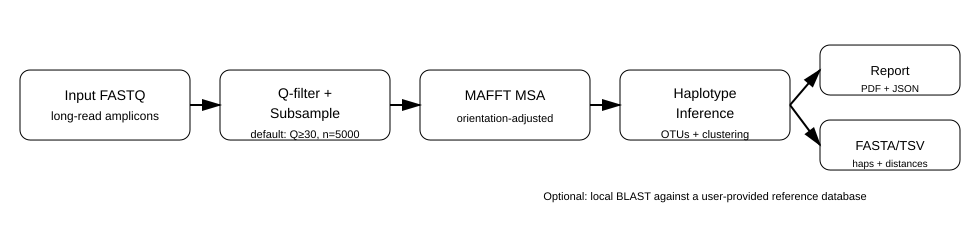

Haemo Mito Pipeline
===================

A **script-first** bioinformatics pipeline for generating **mitochondrial haplotypes**
from long-read amplicon data targeting ~6 kb haemosporidian mitochondrial genomes.

This software is developed and maintained by the **Escalante–Pacheco Lab (Temple University)**
as part of our haemosporidian genomics toolkit.

.. raw:: html

   

     <a class="primary" href="downloads.html">Download Desktop GUI (Windows/macOS)</a>
     <a class="ghost" href="https://github.com/<GITHUB_ORG_OR_USER>/<REPO_NAME>" target="_blank" rel="noopener">Source code</a>
     <a class="secondary" href="https://link.springer.com/article/10.1186/s12936-024-04961-8" target="_blank" rel="noopener">Protocol paper (Malaria Journal, 2024)</a>
   

This documentation site covers:

- What the pipeline does (and what it **does not** do)
- How to run it (CLI + optional desktop GUI)
- How to interpret the outputs (PDF/JSON/FASTA/TSV)
- The experimental protocol context (primer design + sequencing workflow)

.. note::

   This pipeline is designed for research and biodiversity/population studies.
   It is **not** intended as a diagnostic workflow.

Pipeline overview
-----------------

At a high level, the pipeline runs:

1. **FASTQ → Q-filter + subsample** (default: Q≥30, n=5000)
2. **Subsample FASTA → MAFFT MSA** (with orientation adjustment)
3. **MSA + FASTQ → haplotypes/OTUs + report**
4. **(Optional) Local BLAST** per haplotype against a user-provided reference DB
5. **All-vs-all haplotype distance matrix**

   A simplified view of the main steps.

.. toctree::
   :maxdepth: 2
   :caption: Welcome

   introduction
   installation
   quickstart
   downloads
   about_lab

.. toctree::
   :maxdepth: 2
   :caption: Tutorials

   tutorials/index
   tutorials/run_cli
   tutorials/run_gui
   tutorials/using_blast
   tutorials/interpreting_results

.. toctree::
   :maxdepth: 2
   :caption: Parameters

   parameters/essential
   parameters/optional

.. toctree::
   :maxdepth: 2
   :caption: Methods

   methods/experimental_protocol
   methods/pipeline_design

.. toctree::
   :maxdepth: 1
   :caption: Reference

   outputs
   faq
   citation
   changelog
